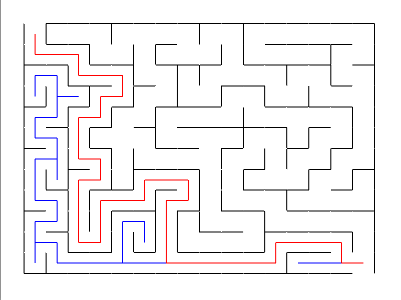

Maze Solver
===========
Maze Solver guided project from [Boot.dev](https://boot.dev).

Objective
---------
Build a visual maze solver using Python and Tkinter.

Requirements
------------
- python3.11
- python-tk

The standard libraries of Python should suffice for this to run. 
In case you receive a Tkinter error on Mac OS X, please install Tkinter with `brew`.

`brew install python-tk`

Execution
---------
`python3 main.py` 

File Tree
---------
```shell
mazesolver
├── README.md
├── cell.py
├── graphics.py
├── main.py
├── maze.py
├── screenshots
│   └── sample_maze_1.png
└── tests.py
```

Sample Run
----------
